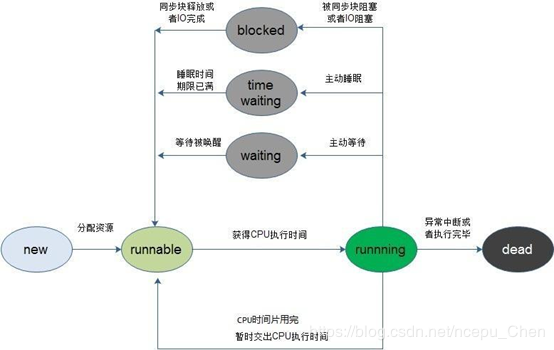

最近在看Java关于线程的相关知识，看的是马士兵老师的高并发编程系列[av11076511](https://www.bilibili.com/video/av11076511)，遂把知识点整理下来，便于以后查阅。

<!--more-->


## 线程的创建

### 通过继承`Thread`类并重写`run()`方法

通过继承`Thread`类并重写`run()`方法，`run()`方法中定义需要线程执行的任务，然后调用实现类的`start()`方法启动这个线程（ps：单纯的调用`run()`方法只是单纯的方法使用，并不能达到启动线程的目的）

```java
public class Current extends Thread {
    public void run() {
        System.out.println("子线程启动,ID为:" + Thread.currentThread().getId() +
                ",名字为" + Thread.currentThread().getName());
    }

        public static void main(String[] args)  {
            // 创建一个线程并开启线程
            Current a = new Current();
            a.start();
            // 多创建几个线程
            new Current().start();
            new Current().start();
            new Current().start();

        }
}
```

输出如下：

```java
子线程启动,ID为:14,名字为Thread-2
子线程启动,ID为:12,名字为Thread-0
子线程启动,ID为:13,名字为Thread-1
子线程启动,ID为:15,名字为Thread-3
```

### 通过继承`Runnable`接口，并实现`run()`方法

通过继承`Runnable`接口，实现`run()`方法，然后调用实现类的`start（）`方法启动这个线程

```java
public class WithRunnable implements Runnable {
    @Override
    public void run() {
        System.out.println("子线程启动,ID为:" + Thread.currentThread().getId() +
                ",名字为" + Thread.currentThread().getName());
    }

    public static void main(String[] args)  {
        // 创建一个线程并开启线程
        Current a = new Current();
        a.start();
        // 多创建几个线程
        new Current().start();
        new Current().start();
        new Current().start();

    }
}
```

输出如下：

```java
子线程启动,ID为:13,名字为Thread-1
子线程启动,ID为:15,名字为Thread-3
子线程启动,ID为:12,名字为Thread-0
子线程启动,ID为:14,名字为Thread-2
```

## 线程的五种状态

线程有五个状态

1. 新生（`new`）：用`new`关键字新建了一个线程对象后，该线程对象处于新生态，此时已经有了自己的内存空间
2. 就绪（`runnable`）：调用了`start（）`方法后，线程从新生态转化为就绪态，此时线程还没有运行，在等待CPU调度
3. 运行（`running`）：处于运行状态的线程正在执行自己的`run()`方法
4. 阻塞`(blocked)`：线程暂停执行，让出CPU时间片，并将其交给其他线程使用
5. 死亡`dead`：当前线程完成工作或者抛出异常时，线程死亡



以上简单的介绍了一下线程的基础，下面是关于线程的同步问题

## 线程同步

在大多数实际的多线程应用中， 两个或两个以上的线程需要共享对同一数据的存取。如果两个线程存取相同的对象， 并且每一个线程都调用了一个修改该对象状态的方法，将会发 生什么呢？ 可以想象，线程彼此踩了对方的脚。根据各线程访问数据的次序，可能会产生i化 误的对象。这样一个情况通常称为竞争条件（race condition)。为了避免多线程引起的对共享数据的说误，必须学习如何同步存取。

### `synchronized`关键字的意义

为了防止代码块受并发访问的干扰，Java语言提供一个 synchronized关键字达 到这一目的，并且 Java SE 5.0引入了 ReentrantLock 类。synchronized 关键字自动提供一个 锁以及相关的“ 条件”， 对于大多数需要显式锁的情况， 这是很便利的。

