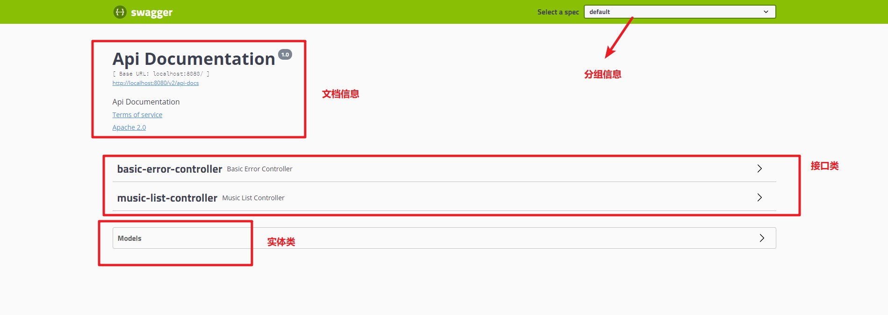

### 使用Swagger构建优雅的Api文档

<!--more-->

# 在Spring中使用Swagger文档

## 1. 导包

在SpringBoot的pom.xml文件中加入依赖，空串问题在另一篇blog有写

```xml
		<!-- Swagger2 Api插件 -->
        <dependency>
            <groupId>io.springfox</groupId>
            <artifactId>springfox-swagger2</artifactId>
            <version>2.9.2</version>
            <!--排除swagger-models1.5.20版本，解决空串问题-->
            <exclusions>
                <exclusion>
                    <groupId>io.swagger</groupId>
                    <artifactId>swagger-models</artifactId>
                </exclusion>
            </exclusions>
        </dependency>
        <!--导入swagger-models1.5.22版本，解决空串问题-->
        <dependency>
            <groupId>io.swagger</groupId>
            <artifactId>swagger-models</artifactId>
            <version>1.5.22</version>
        </dependency>

        <dependency>
            <groupId>io.springfox</groupId>
            <artifactId>springfox-swagger-ui</artifactId>
            <version>2.9.2</version>
        </dependency>
```

## 2. 配置Swagger

#### 2.1 在项目中`Application.java`同级创建Swagger的配置类

```java
@Component
// 开启Swagger2的自动配置
@EnableSwagger2
public class Swagger2Config {
    
}
```

#### 2.2 配置Swagger实例

Swagger实例Bean是Docket，所以通过配置Docket实例来配置Swaggger

```java
@Bean
    public Docket creatRestApi(){
        
        return new Docket(DocumentationType.SWAGGER_2);
        
    }
```

然后启动项目，打开`http://localhost:8080/swagger-ui.html`即可看到接口文档



#### 2.3 配置要扫描的接口

```java
@Bean
    public Docket creatRestApi(){

        return new Docket(DocumentationType.SWAGGER_2)
                .select()
                .apis(RequestHandlerSelectors
                .basePackage("com.ego14t.xinmusic.controller")) //Controller所在的包
                .build();

    }
```

`RequestHandlerSelectors`中还有一些其他的扫描方式

1. `any()` ：扫描所有，项目中的所有接口都会被扫描到
2. `none()`：不扫描接口
3. `withMethodAnnotation(final Class<? extends Annotation> annotation)`：通过在方法上注解扫描如withMethodAnnotation(GetMapping.class)只扫描get请求
4. `withClassAnnotation(final Class<? extends Annotation> annotation)`：通过类上的注解扫描，如.withClassAnnotation(Controller.class)只扫描有controller注解的类中的接口

#### 2.4 配置Api文档信息

```java
	//配置文档信息
    private ApiInfo apiInfo() {
        return new ApiInfoBuilder()
                .title("昕音乐Api文档")
                .description("优雅的Api文档")
                .version("1.0")
                .build();

    }
```

具体可以配置的参数如下：

```java
 	//联系人信息 name，url，email
	public static final Contact DEFAULT_CONTACT = new Contact("", "", "");
    public static final ApiInfo DEFAULT;//默认值
    private final String version;//版本号
    private final String title;//标题
    private final String description;//接口描述
    private final String termsOfServiceUrl;//组织链接
    private final String license;//许可
    private final String licenseUrl;//许可链接
    private final Contact contact;//联系人
    private final List<VendorExtension> vendorExtensions;
```

## 3. 完成


## 4. Api的详细信息配置

1. `@Api`：作用于控制器类上，标识这个类是Swagger资源，tags值会在页面显示

```java
@Api(value = "歌单Controller",tags = {"歌单操作类接口"})
```


2.  `@ApiOperation`：作用于方法上，表示一个http请求的操作，value用于方法描述 ，notes用于提示内容

   ```java
   //tags会添加分组，视情况用
   @ApiOperation(value="根据歌单id返回歌曲列表",tags={""},notes="注意问题点")
   ```

   

3. `@ApiImplicitParams() `：用于方法，参数，字段说明，标识请求参数name参数名，value参数说明，dataType数据类型 ，paramType参数类型 ，example–举例说明，required是否必填

   ```java
   @ApiImplicitParam(paramType="query", name = "id", value = "歌单ID", required = true, dataType = "int")
   ```

   ```java
   @ApiImplicitParams({
     @ApiImplicitParam(paramType="query", name = "id", value = "歌单ID", required = true, dataType = "int"),
     @ApiImplicitParam(paramType="query", name = "username", value = "用户名", required = true, dataType = "String")})
   ```
4. `ApiImplicitParam`中的`paramType`参数

   | paramType参数           | 请求参数的获取                 |
   | ----------------------- | ------------------------------|
   | header                  | @RequestHeader(代码中接收注解) |
   | query                   | @RequestParam(代码中接收注解)  |
   | path（用于restful接口）  | @PathVariable(代码中接收注解)  |
   | body                    | @RequestBody(代码中接收注解)   |
   
   