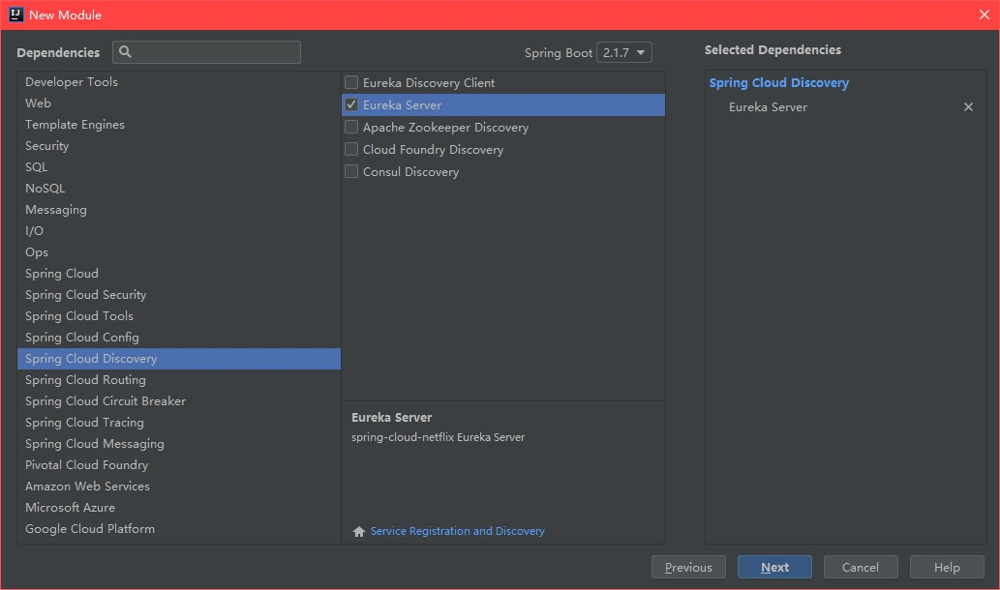

Spring Cloud是目前用于开发微服务的主流框架之一，我们都知道在微服务架构中最为基础、核心的模块，就是服务注册与发现。在Spring Cloud里我们可以使用它的Eureka模块来实现服务注册与发现，Spring Cloud Eureka是基于Netflix Eureka做了二次封装，它主要负责完成各个微服务实例的自动化注册和发现功能。  

Eureka由两个组件组成：

1. Eureka Server（注册中心）

2. Eureka Client （服务注册）

# Eurek Server搭建

## 在IDEA中新建一个Spring boot项目

填写项目名之后，添加依赖，选择Spring Cloud Discovery-->Eureka Server，如图：



pom.xml文件的依赖如下：

```xml
<dependencies>
        <dependency>
            <groupId>org.springframework.cloud</groupId>
            <artifactId>spring-cloud-starter-netflix-eureka-server</artifactId>
        </dependency>

        <dependency>
            <groupId>org.springframework.boot</groupId>
            <artifactId>spring-boot-starter-test</artifactId>
            <scope>test</scope>
        </dependency>
    </dependencies>
```

## 改主类

在主类上添加`@EnableEurekaServer`注解

```java
import org.springframework.boot.SpringApplication;
import org.springframework.boot.autoconfigure.SpringBootApplication;
import org.springframework.cloud.netflix.eureka.server.EnableEurekaServer;
//开启Eureka服务注册中心
@EnableEurekaServer
@SpringBootApplication
public class XinmusicEurekaApplication {

    public static void main(String[] args) {
        SpringApplication.run(XinmusicEurekaApplication.class, args);
    }

}
```

## 配置application.yml

```yaml
server:
  port: 8081 # 服务端口号

eureka:
  instance:
    hostname: 127.0.0.1 # 注册中心IP地址
  client:
    registerWithEureka: false # 指定不进行注册操作，默认为true，若进行注册的话，会显示在Eureka信息面板上
    fetchRegistry: false # # 实例是否在eureka服务器上注册自己的信息以供其他服务发现，默认为true 如果是做高可用的发现服务那就要改成true
    serviceUrl:
      defaultZone: http://${eureka.instance.hostname}:${server.port}/eureka/ # 指定注册中心的地址
```

## 启动


# Eureka Client的使用

## 添加依赖

在已有的项目中添加依赖，在pom.xml中添加依赖，如下：

```xml
<dependency>
            <groupId>org.springframework.cloud</groupId>
            <artifactId>spring-cloud-starter-netflix-eureka-client</artifactId>
        </dependency>


<dependencyManagement>
        <dependencies>
            <dependency>
                <groupId>org.springframework.cloud</groupId>
                <artifactId>spring-cloud-dependencies</artifactId>
                <version>${spring-cloud.version}</version>
                <type>pom</type>
                <scope>import</scope>
            </dependency>
        </dependencies>
    </dependencyManagement>
```

## 改主类

在服务提供者项目主类上添加注解`@EnableDiscoveryClient`声明这是一个eureka client，进行服务注册

```java
import org.springframework.boot.SpringApplication;
import org.springframework.boot.autoconfigure.SpringBootApplication;
import org.springframework.cloud.netflix.eureka.EnableEurekaClient;

@EnableEurekaClient
@SpringBootApplication
public class XinmusicApplication {

    public static void main(String[] args) {
        SpringApplication.run(XinmusicApplication.class, args);
    }

}

```

## 配置application.yml

```yml
eureka:
  client:
    service-url:
      defaultZone: http://127.0.0.1:8081/eureka/  # eureka注册中心的地址
spring:
  application:
    name: music-list-service #服务名称--调用的时候根据名称来调用该服务的方法
server:
  port: 8082 # 该项目的启动端口
```

## 启动

