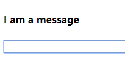
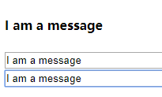

# Vue笔记&ensp;Day2
<!--more-->
## Vue事件修饰符
### 1. “.stop”&ensp;阻止冒泡事件
```html
<!--当出发Button的点击事件后，会立即触发div的点击事件-->
        <div class='inner' @click='div1Handler'>
            <!-- 用.stop 阻止冒泡-->
            <input type="button" value="Button1" @click.stop='btnHandler'>
        </div>
```
### 2. “.prevent”&ensp;阻止默认事件
```html
<!--当触发Button点击事件后，会阻止默认事件，即不触发a标签跳转事件-->
        <a href="http://www.google.com" class="href"  
        @click.prevent='linkClick'>Google</a>
```
### 3. “.capture”&ensp;与冒泡事件正好相反，从外向内触发事件
```html
<!--使用capture实现触发事件的机制 先触发divHandler，再触发btnHandler-->
        <div class="inner" @click.capture='div1Handler'>
            <input type="button" value="Button2" @click='btnHandler'>
        </div>
```
### 4.  “.self”&ensp;只有点自己才会执行
```html
<!--使用self实现自己单独执行，不触发冒泡事件-->
        <div class="inner" @click.self='div1Handler'> 
            <input type="button"  value="Button3" @click='btnHandler'>
        </div>
```
### 5. “.once”&ensp;只执行一次，可与其他修饰符串联，如：
```html
<!--串联修饰符， 阻止一次事件触发 使用once, prevent可以触发一次事件处理函数-->
        <a href="http://www.baidu.com"  
        @click.once.prevent='linkClick'>Baidu</a>
        <!--或者-->
        <a href="http://www.baidu.com"  
        @click.prevent.once='linkClick'>Baidu</a>
```
### 6. “.self”与“.stop”的区别
+ .stop:阻止所有的冒泡行为  
```html
<!--点击button不会向外冒泡触发其他外层事件-->
    <div class="outer" @click="div2Handler">
        <div class="inner" @click="div1Handler">
            <input type="button" value="ButtonSTOP" @click.stop='btnHandler'>
        </div>
    </div>
```
+ .self:只会阻止自己的冒泡行为  
```html
<!--点击button，向外冒泡触发，inner事件有self修饰故不触发，然后触发outer的事件-->
    <div class="outer" @click="div2Handler">
        <div class="inner" @click.self="div1Handler">
            <input type="button" value="Button" @click='btnHandler'>
        </div>
    </div> 
```
## v-bind与v-model
### 先上一段代码：  
```html
<body>
    <div id="app">
        <h4>{{msg}}</h4>
        <input type="text" v-bind:value="msg" style="width: 100%; "> 
        <input type="text" v-model:value='msg' style='width: 100%;'>
    </div>
    <script>
        var vm = new Vue(
            {
                el: '#app',
                data: {
                    msg: 'I am a message',
                },
            }
        )
    </script>
</body>
```
+ v-bind只能实现数据的单向绑定
+ v-model可以实现数据的双向绑定，v-model只能运用在表单元素中  
### v-bind:  
  
修改v-bind绑定的文本框的值，并不会改变msg的值  
### v-model:  
  
修改v-model绑定的文本框的值，会改变msg的值，vue监听到data属性中msg值的改变，从而改变v-bind绑定的文本框的值  
v-model--->改变msg--->改变v-model