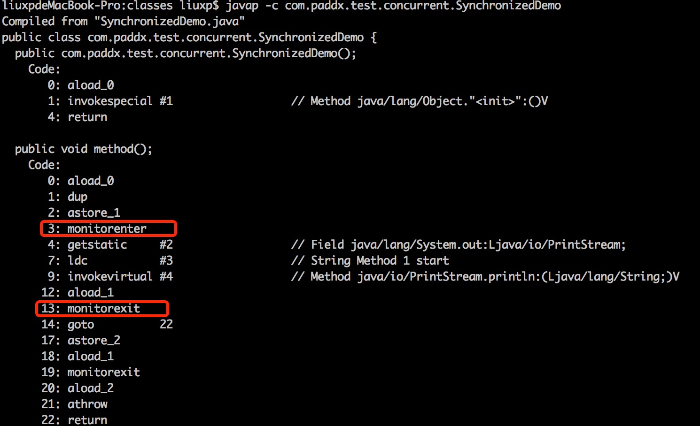
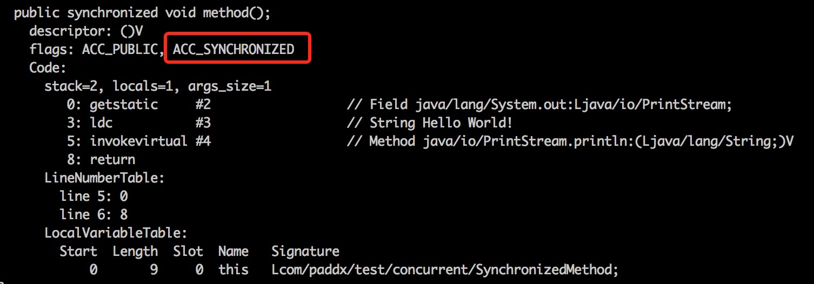

### `synchronized`关键字的意义

为了防止代码块受并发访问的干扰，Java语言提供一个 synchronized关键字达 到这一目的，并且 Java SE 5.0引入了 ReentrantLock 类。synchronized 关键字自动提供一个 锁以及相关的“ 条件”， 对于大多数需要显式锁的情况， 这是很便利的。

<!--more-->

### `synchronized`关键字的作用

synchronized关键字是对某个对象加锁

举个例子，如以下代码段：

```java
private Object o = new Object();
public void m() {
	synchronized(o) { //任何线程要执行下面的代码，必须先拿到o的锁
		count--;
		System.out.println(Thread.currentThread().getName() + " count = " + count);
		}
}
```

还有另一种用法

```java
public void m() {   
    synchronized(this) { //任何线程要执行下面的代码，必须先拿到this的锁      
        count--;      			
        System.out.println(Thread.currentThread().getName() + " count = " + count);   
    }
}
```

这种方式等同于如下代码段：

```java
public synchronized void m() { //等同于在方法的代码执行时要synchronized(this)   
    count--;   
    System.out.println(Thread.currentThread().getName() + " count = " + count);
}
```

**注意**：当`synchronized`关键字修饰方法时，锁定的是this，也就是该对象本身；当`synchronized`关键字修饰的是静态方法或者静态变量时，锁定的是`对象.class`

### `synchronized`关键字的注意点

1. 同步方法和非同步方法可以同时调用，原因是调用非同步方法时不需要拿到锁
2. 在应用场景中，对写方法（set）加锁，对读方法（get）不加锁，容易产生脏读问题，原因是，在①线程写入操作还没有完成时，此时②线程读取数据，此时读到的数据不是实际写入的数据
3. 一个同步方法可以调用另一个同步方法，一个线程已经拥有某个对象的锁，再次申请的时候，仍然会得到该对象的锁，也就是说`synchronized`获得的锁是可重入的
4. 可重入锁的实现机制是：每一个锁关联一个线程持有者和计数器，当计数器为 0 时表示该锁没有被任何线程持有，那么任何线程都可能获得该锁而调用相应的方法；当某一线程请求成功后，JVM会记下锁的持有线程，并且将计数器置为 1；此时其它线程请求该锁，则必须等待；而该持有锁的线程如果再次请求这个锁，就可以再次拿到这个锁，同时计数器会递增；当线程退出同步代码块时，计数器会递减，如果计数器为 0，则释放该锁。
5. 子类可以调用父类的同步方法，锁住的是子类对象
6. 在同步方法执行的过程中，如果出现异常，默认情况下锁会被释放，若不想被释放，则需要`catch`异常

###  `synchronized`的原理

#### 同步代码块



**monitorenter ：**

每个对象有一个监视器锁（monitor）。当monitor被占用时就会处于锁定状态，线程执行monitorenter指令时尝试获取monitor的所有权，过程如下：

1、如果monitor的进入数为0，则该线程进入monitor，然后将进入数设置为1，该线程即为monitor的所有者。

2、如果线程已经占有该monitor，只是重新进入，则进入monitor的进入数加1.

3.如果其他线程已经占用了monitor，则该线程进入阻塞状态，直到monitor的进入数为0，再重新尝试获取monitor的所有权。

**monitorexit：**

　　执行monitorexit的线程必须是objectref所对应的monitor的所有者。

​		指令执行时，monitor的进入数减1，如果减1后进入数为0，那线程退出monitor，不再是这个monitor的所有者。其他被这个monitor阻塞的线程可以尝试去获取这个 monitor 的所有权。

　　Synchronized的语义底层是通过一个monitor的对象来完成，其实wait/notify等方法也依赖于monitor对象，这就是为什么只有在同步的块或者方法中才能调用wait/notify等方法，否则会抛出java.lang.IllegalMonitorStateException的异常的原因。


#### 同步方法



从反编译的结果来看，方法的同步并没有通过指令monitorenter和monitorexit来完成（理论上其实也可以通过这两条指令来实现），不过相对于普通方法，其常量池中多了ACC_SYNCHRONIZED标示符。JVM就是根据该标示符来实现方法的同步的：当方法调用时，调用指令将会检查方法的 ACC_SYNCHRONIZED 访问标志是否被设置，如果设置了，执行线程将先获取monitor，获取成功之后才能执行方法体，方法执行完后再释放monitor。在方法执行期间，其他任何线程都无法再获得同一个monitor对象。 其实本质上没有区别，只是方法的同步是一种隐式的方式来实现，无需通过字节码来完成。


参考资料：

https://www.cnblogs.com/huangyin/p/6586469.html


